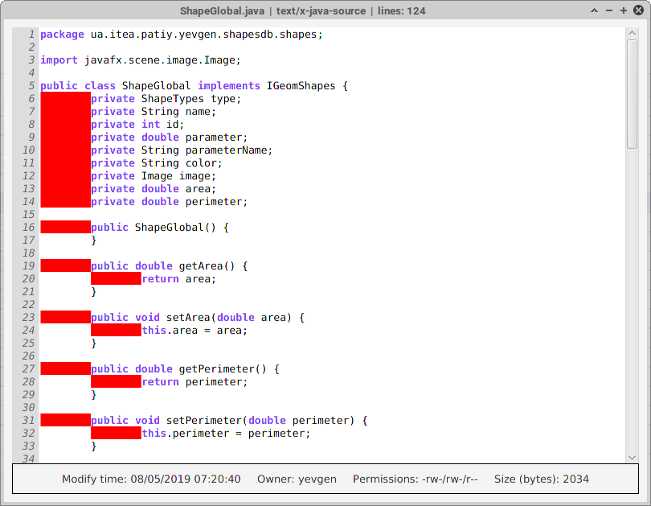

# Check/fix code with tab characters and count lines you've produced

Java-written application for simple code check (**TABS** issue) and lines count

## Environment requirements

Existing [Java 8](https://www.java.com/en/download/) and [MAVEN](https://maven.apache.org/) installation required

## Installation and usage

* Clone current git repository to local machine

`git clone https://github.com/evgenpatiy/code-checker.git`

* Compile source code using command below. 
   
`mvn compile assembly:single` 

* "target" directory will be created, find **CodeChecker-1.0-SNAPSHOT-jar-with-dependencies.jar** inside and run application as per below, or just double-click on it

`java -jar CodeChecker-1.0-SNAPSHOT-jar-with-dependencies.jar`

* Main screen: use listbox at the top to switch application interface language (English/Ukrainian) and choose your sources folder. Proper file types could be selected at
bottom checkboxes

* Files list with highlighted items that still have <TAB> characters in code, see tooltip for more detailed file info. Use right mouse button on files marked red to fix it
directly from application (.old file version would be created as backup), or view your code

## Author

- Yevgen Patiy

## License

Feel free to use, modify or distribute this software. This project is licensed under the [GNU GPL 2.0 license](https://www.gnu.org/licenses/old-licenses/gpl-2.0.uk.html).
